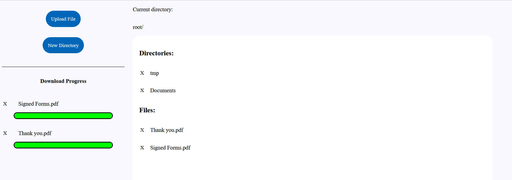

# backup-site
This is the code for a website that allows you to locally create an easily accessible cloud storage solution.

By launching this application you designate the computer you launched it from as a storage center. You can then access the website from any device on the same network and instantly get access to all uploaded files and upload them yourself.
This allows for not only truly private uploading of your data but to easily transfer files between devices or send them off to storage.

It also features uniqueness detection of files. Every file uploaded will be checked for uniqueness againist every other file in the same directory, ensuring you never reupload the same file twice.

